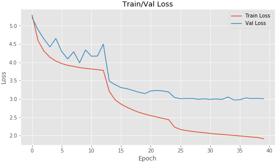
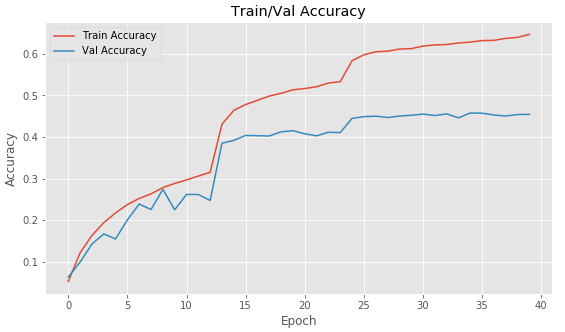

# Tiny ImageNet Dataset

Tiny ImageNet dataset consists of 200 different classes. Images represent 64x64 pixels and each 
class has 1000 images.

## Building dataset 
For building dataset I used hdf5 database. In [create_dataset.py](https://github.com/aqua1907/tiny_imagenet/blob/master/create_dataset.py)
I get an image from corresponding folder which is a label of image and using [HDF5Dasetwriter](https://github.com/aqua1907/tiny_imagenet/blob/master/hdf5/hdf5datasetwriter.py) class serialize pixels and class label
to the dataset and serialize R, G, B channels from each image to corresponding list. ```def save_mean_values(path)``` takes mean from each channel and save it to ```.json``` file.

Thus, I have 3 dataset:
- ```train.hdf5``` — 8.6 Gb;
- ```val.hdf5``` — 960 Mb;
- ```test.hdf5``` — 960 Mb;

## Training 

For my research I used [ResNet-50](https://github.com/aqua1907/tiny_imagenet/blob/master/model/RestNet50.py). 
For feeding data to neural network I use [HDF5DatasetGenerator](https://github.com/aqua1907/tiny_imagenet/blob/master/hdf5/hdf5datasetgenerator.py) 
class. Unfortunately Tiny ImageNet consists 1000 images per class, so I used [Keras ImagaDataGenerator](https://keras.io/preprocessing/image/)
for data augmentation. As a optimiser I chose **SGD_Optimiser** and for computing loss **sparse_categorical_crossentropy**
because I serialized labels as integers which represented in [```t_imgNet_class_index.json```](https://github.com/aqua1907/tiny_imagenet/blob/master/t_imgNet_class_index.json) created by [```create_class_index.py```](https://github.com/aqua1907/tiny_imagenet/blob/master/create_class_index.py)
Whole training process is represented in [Jupyter Notebook](https://github.com/aqua1907/tiny_imagenet/blob/master/source.ipynb) file.

## Results

```
Epoch 36/75
1406/1406 [==============================] - 721s 513ms/step - loss: 1.9896 - accuracy: 0.6318 - val_loss: 2.9795 - val_accuracy: 0.4572
Epoch 37/75
1406/1406 [==============================] - 721s 513ms/step - loss: 1.9768 - accuracy: 0.6323 - val_loss: 3.0279 - val_accuracy: 0.4530
Epoch 38/75
1406/1406 [==============================] - 722s 513ms/step - loss: 1.9599 - accuracy: 0.6372 - val_loss: 3.0102 - val_accuracy: 0.4505
Epoch 39/75
1405/1406 [============================>.] - ETA: 0s - loss: 1.9489 - accuracy: 0.6394
Epoch 00039: ReduceLROnPlateau reducing learning rate to 9.999999310821295e-05.
1406/1406 [==============================] - 721s 513ms/step - loss: 1.9489 - accuracy: 0.6395 - val_loss: 3.0172 - val_accuracy: 0.4540
Epoch 40/75
1405/1406 [============================>.] - ETA: 0s - loss: 1.9140 - accuracy: 0.6468Restoring model weights from the end of the best epoch.
1406/1406 [==============================] - 722s 513ms/step - loss: 1.9140 - accuracy: 0.6467 - val_loss: 3.0057 - val_accuracy: 0.4545
Epoch 00040: early stopping
Took time:  08:03:29
```

### Loss/Accuracy graph

 

After training I obtained:
```
Loss =  2.9874142790452027
Accuracy = 46.18%
```
